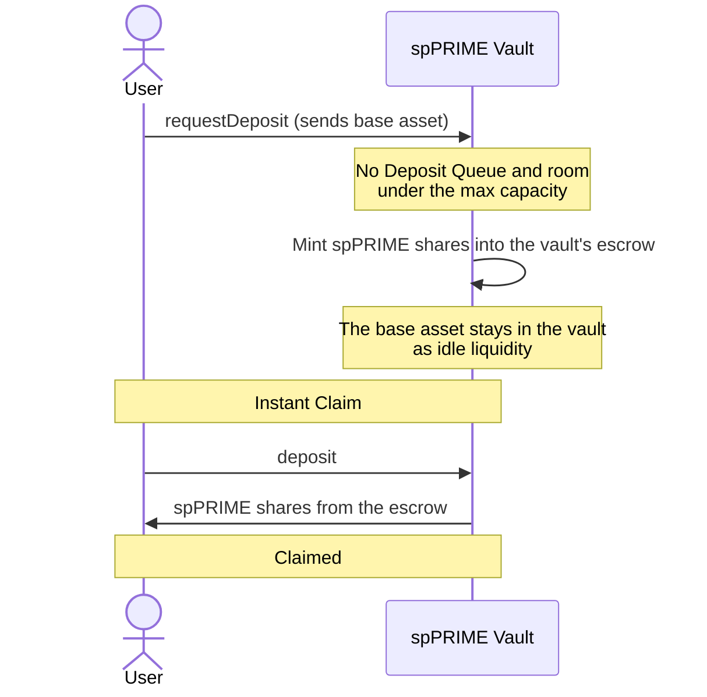

# Deposit: instant claim

No one is waiting in the Deposit Queue and the vault is below its max capacity, so the deposit is claimable straight away.

If the room under the max capacity covers only part of the request, that part follows this flow and the rest [joins the Deposit Queue](deposit-queued.md).

`mint` claims the same way as `deposit`. Spark can claim on the user's behalf once the user sets Spark as their operator.
