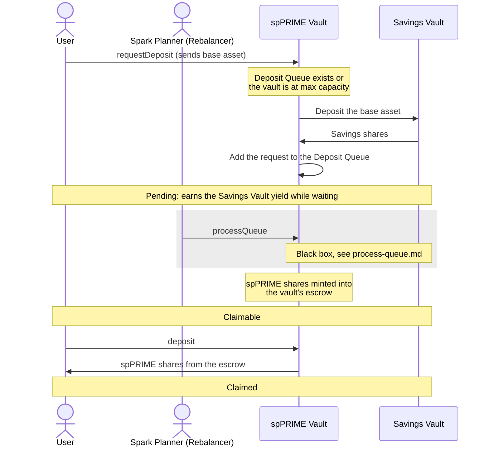

# Deposit: through the Deposit Queue

Someone is already waiting in the Deposit Queue, or the vault is at its max capacity, so the deposit waits in the Savings Vault until Spark processes the queue.

While the request is Pending, the user can cancel it and receive the base asset back from the Savings Vault, including the yield earned while waiting.

`mint` claims the same way as `deposit`. Spark can claim on the user's behalf once the user sets Spark as their operator.
