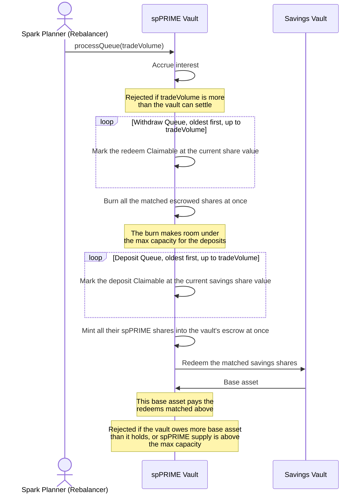

# processQueue

Spark matches the waiting redeems against the waiting deposits. `tradeVolume` is how much base asset value Spark wants to settle in this call.

The Withdraw Queue always goes first, because its burn frees room under the max capacity for the deposit mints.

The last request matched in each queue can be partly filled. The rest of it stays at the front of its queue for the next call.

Requests stop earning yield once they are Claimable. The value each user will claim is fixed at this point.

A `tradeVolume` is rejected when it is more than either:
- the idle base asset plus the value of the Deposit Queue, or
- the value of the Withdraw Queue plus the room left under the max capacity.

`maxTradeVolume()` returns the largest `tradeVolume` that passes both checks.
