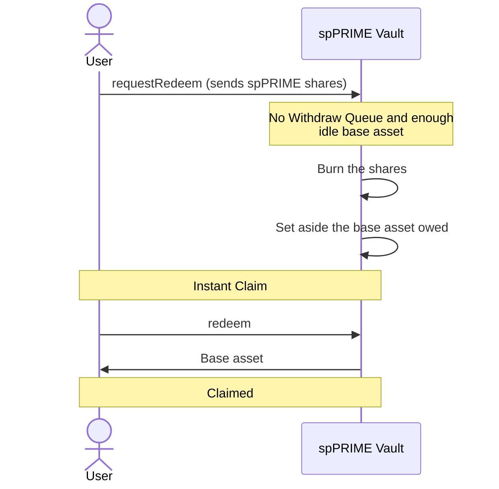

# Redeem: instant claim

No one is waiting in the Withdraw Queue and the vault holds enough idle base asset, so the redeem is claimable straight away.

Instant redeems are paid from the vault's idle base asset only, never from the Savings Vault.

If the idle base asset covers only part of the request, that part follows this flow and the rest [joins the Withdraw Queue](redeem-queued.md).

`withdraw` claims the same way as `redeem`. Spark can claim on the user's behalf once the user sets Spark as their operator.
