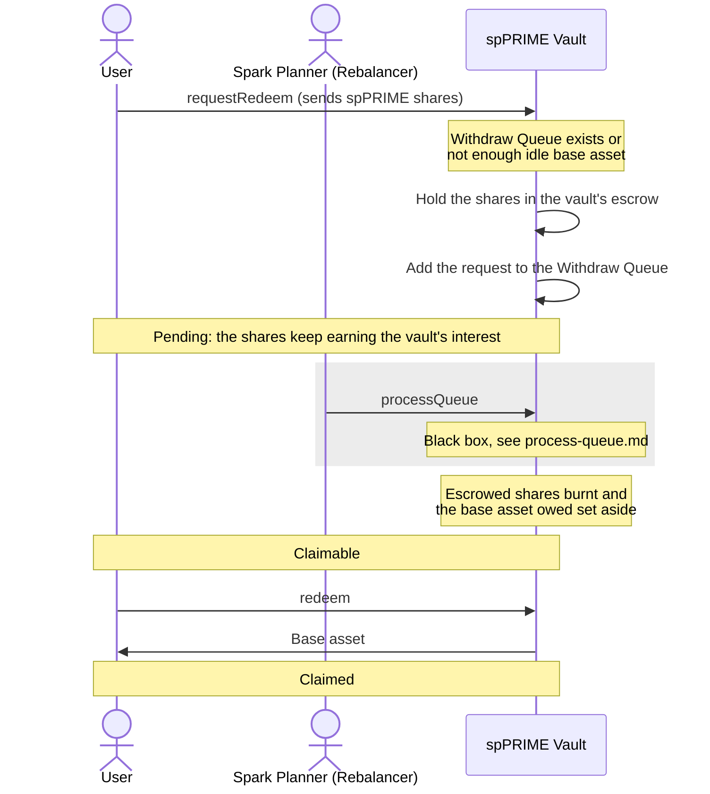

# Redeem: through the Withdraw Queue

Someone is already waiting in the Withdraw Queue, or the vault does not hold enough idle base asset, so the redeem waits until Spark processes the queue.

A redeem cannot be cancelled once it is in the Withdraw Queue.

`withdraw` claims the same way as `redeem`. Spark can claim on the user's behalf once the user sets Spark as their operator.
